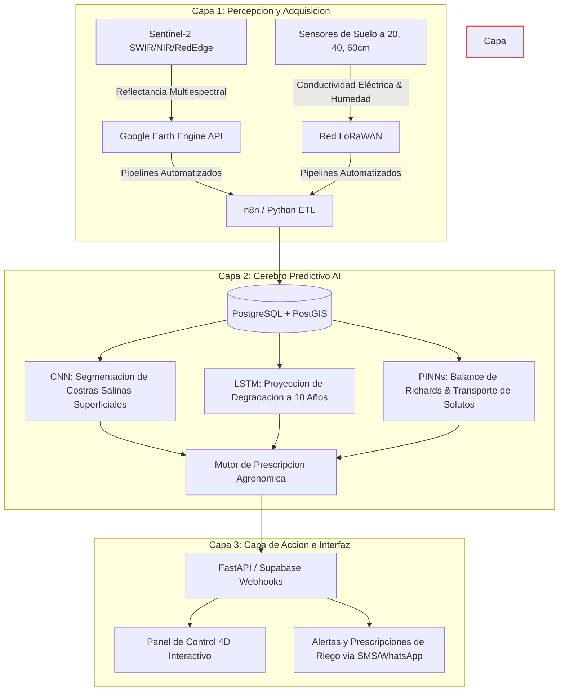

# Sat-Agro: Infraestructura Digital de Seguridad Alimentaria
### *Premio de Innovación Tecnológica para la Sostenibilidad Agrícola - GeoTón Perú*

> **"El suelo habla, la infraestructura responde"**  
> Una plataforma de agronomía predictiva de precisión diseñada para combatir la crisis de salinización de la costa peruana mediante datos satelitales multiespectrales, sensores físicos en sitio y gemelos digitales con física integrada (PINNs).

---

## 🌍 La Crisis de la Salinización en la Costa Peruana

La costa peruana, responsable del 65% de la producción de agroexportación de alto valor y soberanía alimentaria del país, enfrenta una degradación crítica. Aproximadamente **40% de los suelos agrícolas de los valles costeros están salinizados o en proceso acelerado de degradación**.

El problema es especialmente alarmante en:
*   **Chancay-Lambayeque:** El cultivo inundado de arroz sobrecarga un subsuelo sin drenaje efectivo, elevando el nivel freático y concentrando sales en la superficie por evaporación extrema.
*   **Piura (Chira-Piura):** La falta de un drenaje eficiente en suelos arenosos de irrigaciones masivas causa salinización secundaria.
*   **Ica (Villacurí):** La sobreexplotación de los acuíferos provoca intrusión salina en pozos profundos, regando con agua salobre que envenena el suelo de forma progresiva.

**Sat-Agro** rompe el paradigma de la simple observación ("ver el problema") y lo reemplaza por la **intervención prescriptiva automatizada** ("corregir el problema en tiempo real").

---

## 🧠 Arquitectura de la Solución (3 Capas)



### 🛰️ 1. Capa de Percepción: Teledetección y Suelo IoT
1.  **Satélite Sentinel-2:** Extracción automática de índices de salinidad y vegetación:
    *   **NDVI (Índice de Vegetación de Diferencia Normalizada):** $\frac{B8 - B4}{B8 + B4}$ (Vigor y clorofila).
    *   **NDWI (Índice de Agua de Diferencia Normalizada):** $\frac{B8 - B11}{B8 + B11}$ (Humedad foliar y estrés hídrico).
    *   **SI (Salinity Index):** $\sqrt{B4 \times B8}$ o $\frac{B11 - B8}{B11 + B8}$ (Detección directa de acumulación de sales en superficies desnudas).
2.  **Sensores IoT Subsuperficiales:** Módems con sensores de alta sensibilidad TDR (Reflectometría en el Dominio del Tiempo) que registran:
    *   **Conductividad Eléctrica Aparente ($EC_a$):** Medida en deciSiemens por metro ($dS/m$).
    *   **Contenido Volumétrico de Agua ($\theta$):** Porcentaje de humedad volumétrica.
    *   **Temperatura del Suelo.**

### ⚗️ 2. Capa de Inteligencia: Modelos Híbridos y PINN
No dependemos únicamente del aprendizaje estadístico puro (que carece de contexto físico y tiende a fallar ante eventos climáticos extremos como El Niño). Sat-Agro integra la física del suelo en el propio entrenamiento de la IA mediante **PINNs (Physics-Informed Neural Networks)**:
*   **Ecuación de Richards (Flujo de agua no saturado):**
    $$\frac{\partial \theta}{\partial t} = \frac{\partial}{\partial z} \left[ K(\theta) \left( \frac{\partial \psi}{\partial z} + 1 \right) \right]$$
    *Donde $\theta$ es la humedad del suelo, $t$ el tiempo, $z$ la profundidad, $K(\theta)$ la conductividad hidráulica y $\psi$ el potencial matricial.*
*   **Ecuación de Advección-Dispersión (Transporte de sales):**
    $$\frac{\partial (\theta C)}{\partial t} = \frac{\partial}{\partial z} \left[ \theta D \frac{\partial C}{\partial z} \right] - \frac{\partial (q C)}{\partial z}$$
    *Donde $C$ es la concentración de sales (salinidad), $D$ es el coeficiente de difusión-dispersión y $q$ es el flujo de agua.*

El sistema de IA optimiza los pesos de las redes minimizando una función de pérdida combinada:
$$\mathcal{L} = \mathcal{L}_{datos} + \lambda \mathcal{L}_{física}$$
Esto garantiza que la IA respete la conservación de masa de agua y la conservación de masa de sal, proporcionando predicciones robustas incluso en zonas sin sensores físicos.

### 💧 3. Capa de Acción: Motor de Prescripción
Genera decisiones agronómicas matemáticas automatizadas para agricultores y comisiones de regantes:
*   **Requerimiento de Lavado ($LR$):**
    $$LR = \frac{EC_w}{5 \cdot EC_e - EC_w}$$
    *Determina el porcentaje de agua adicional que debe aplicarse para arrastrar las sales fuera de la zona de raíces basándose en la salinidad del agua de riego ($EC_w$) y el umbral de tolerancia del cultivo ($EC_e$).*
*   **Enmiendas de Yeso ($GR$):**
    $$GR = f(PSI_{actual} - PSI_{objetivo}) \times \text{Densidad Aparente} \times \text{Profundidad}$$
    *Calcula la cantidad exacta de toneladas de yeso agrícola por hectárea necesarias para reemplazar el sodio intercambiable (que dispersa las arcillas y destruye la estructura del suelo) por calcio, recuperando la permeabilidad.*

---

## 🚀 Guía de Estructura del Prototipo

El presente repositorio contiene una implementación del sistema Sat-Agro:

1.  **`database/schema.sql`:** Esquema de base de datos relacional y geoespacial PostgreSQL con extensión **PostGIS**. Mapea parcelas, canales de riego, sensores y lecturas espaciales.
2.  **`data/sensor_simulator.py`:** Un generador físico-matemático en Python que genera series temporales de humedad, conductividad y datos multiespectrales para el Valle Chancay-Lambayeque.
3.  **`brain/pinn_model.py`:** El procesador analítico y solver de la ecuación de Richards, transporte de sales y cálculo de requerimientos de lavado y yeso.
4.  **`dashboard/`:** Una interfaz interactiva en 4D ultra-premium construida en HTML5/CSS3/JavaScript con mapas de calor geoespaciales interactivos (vía **Leaflet.js**), visualizaciones de series temporales de degradación (vía **Chart.js**) y un panel interactivo de simulación de escenarios de estrés hídrico e intrusión salina.

### Ejecución del Prototipo
1.  **Simular Datos de Sensores y Satélite:**
    ```bash
    python data/sensor_simulator.py
    ```
2.  **Ejecutar Motor de Prescripción y Solución PINN:**
    ```bash
    python brain/pinn_model.py
    ```
3.  **Visualizar el Dashboard:**
    Abre el archivo [dashboard/index.html](file:///C:/Users/bryan/SATagro/dashboard/index.html) en tu navegador preferido.

---

## 🎖️ ¿Por qué Sat-Agro es un Candidato Ganador Mundial?

1.  **Eficiencia Hídrica Radical (Ahorro del 40%):** En lugar de regar por calendario (método tradicional), Sat-Agro indica cuándo y cuánto regar basándose en el potencial matricial y salinidad del suelo, evitando la sobre-saturación freática.
2.  **Recuperación Activa de Suelos Muertos:** La plataforma no solo muestra la degradación; prescribe la dosificación exacta de enmiendas (yeso/azufre) y riegos de lavado, devolviendo hectáreas perdidas a la producción alimentaria activa.
3.  **Escalabilidad Global Modular:** La arquitectura desacoplada y basada en APIs permite conectar el modelo a cualquier cuenca agrícola costera en el mundo (ej. Valle de San Joaquín en California, Cuenca del Nilo en Egipto, o el Murray-Darling en Australia).
4.  **Enfoque de Datos Abiertos:** Integrado con la plataforma **Geo Perú** de la Presidencia del Consejo de Ministros (PCM) para democratizar el acceso a los datos espaciales y potenciar políticas públicas agrícolas basadas en evidencia.
