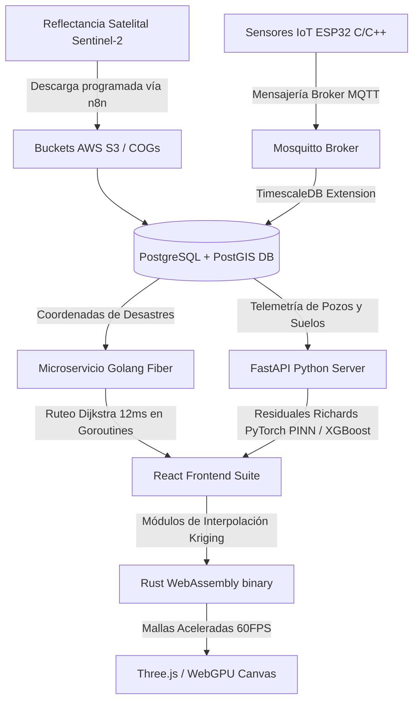

# 🌌 Arquitectura e Infraestructura Tecnológica de GeoTERRA Perú
### *Manual de Ingeniería del Sistema Operativo de Gobernanza Territorial para la Gestión Integrada de la Biosfera y la Tecnosfera (Geotón Perú 2026)*

Este manual detalla la **arquitectura técnica completa, el stack tecnológico políglota de extremo a extremo, los modelos matemático-físicos integrados, las estructuras SQL espaciales de alto rendimiento, y la distribución modular** de toda la suite **GeoTERRA Perú** en su repositorio integrado.

---

## 📂 1. Mapa General del Repositorio: Ecosistema GeoData Perú

El repositorio de **GeoData Perú** se estructura físicamente como una arquitectura políglota híbrida de cuatro componentes y servicios principales:

```text
c:/Users/bryan/GeoData Perú/
├── SATagro/                      # 🧠 BACKEND CIENTÍFICO E INFRAESTRUCTURA DE DATOS (Python Core)
│   ├── brain/                    # Resolvedores físicos matemáticos
│   │   └── pinn_model.py         # Solver PINN (Richards & Convección-Dispersión) en PyTorch
│   ├── data/                     # Ingestores y simuladores físicos de suelo
│   │   └── sensor_simulator.py   # Ingestor dinámico del Valle Chancay-Lambayeque
│   ├── database/                 # Estructura del motor espacial
│   │   └── schema.sql            # Script SQL de inicialización espacial de producción
│   ├── dashboard/                # Prototipo inicial 2D
│   │   └── index.html            # Visor espacial en Leaflet.js
│   ├── server.py                 # API REST principal en FastAPI
│   └── README.md                 # Documentación del backend Sat-Agro
│
├── nexus_router/                 # 🐹 MOTOR DE ALTA CONCURRENCIA VIAL (Golang)
│   ├── go.mod                    # Módulo Go inicializado (v1.22)
│   ├── main.go                   # API HTTP Fiber para ruteo logístico
│   └── graph_solver.go           # Algoritmo Dijkstra / A* multihilo en RAM
│
├── wasm_core/                    # 🦀 MÓDULOS DE ACELERACIÓN EN EL CLIENTE (Rust)
│   ├── Cargo.toml                # Configuración de compilación a WebAssembly (Wasm)
│   ├── README.md                 # Guía de compilación e integración en React
│   └── src/
│       └── lib.rs                # Algoritmo de interpolación Kriging ordinario en Rust
│
└── regenTERRA/                   # 🎨 CLIENTE DE GOBERNANZA MULTIDIMENSIONAL (React Frontend)
    ├── src/
    │   ├── components/           # Componentes base de la suite
    │   │   └── Layout.tsx        # UI base y selector de dimensiones con HSL dinámico
    │   ├── context/
    │   │   └── DimensionContext.tsx # Control de estado reactivo global (Seguridad, Desastres, Recursos)
    │   ├── modules/              # 🧠 ARQUITECTURA MODULAR POR CARACTERÍSTICAS
    │   │   ├── edafologia/       # Módulo Agrícola (Edafo-OS / O.M.N.I. TERRA)
    │   │   │   ├── Map3DKriging.tsx  # Visor 3D acelerado por WebGL (Three.js) de Kriging espacial
    │   │   │   ├── Telemetria.tsx    # Terminal LoRaWAN y calibración espectral Sentinel-2
    │   │   │   └── RecetasVRA.tsx    # Calculadora de enmiendas yeso (VRA) y XGBoost Predictor
    │   │   ├── riesgos/          # Módulo de Mitigación (N.E.X.U.S. 4D)
    │   │   │   └── MandoRiesgos.tsx  # Mapa vectorial SVG, simulación de huaicos y ruteo pgRouting
    │   │   └── catastro/         # Módulo Inclusivo (SAT-Agro Pro)
    │   │       └── VisorCatastral.tsx # Integración interactiva del catastro 2D del Valle Chancay
    │   ├── App.tsx               # Enrutamiento React Router
    │   └── main.tsx              # Punto de entrada de la UI
    └── Arquitectura_Completa_GeoTERRA.md # Este manual técnico
```

---

## 📊 2. La Arquitectura Corporativa Multicapa e Infraestructura

GeoTERRA Perú rechaza el uso de una infraestructura homogénea tradicional. En su lugar, implementa un **esquema tecnológico híbrido de alto rendimiento políglota de 5 capas**, diseñado para unir la **velocidad de bajo nivel de hardware** con el **cómputo científico de IA** y la **interactividad de interfaces 3D**.

```
┌─────────────────────────────────────────────────────────────────────────────┐
│                    CAPA 1: INTERFAZ ULTRA-PREMIUM (FRONTEND)                │
│    React + Vite + TypeScript + Tailwind CSS                                 │
│    WebAssembly (WASM): Compilación nativa de Rust en el navegador           │
│    WebGPU / WebGL: Aceleración por hardware para mallas 3D y Kriging        │
│    Deck.gl / Leaflet: Capas vectoriales geográficas y catastrales           │
└──────────────────────────────────────┬──────────────────────────────────────┘
                                       │
                                       ▼ [Consumo de API REST/gRPC]
┌─────────────────────────────────────────────────────────────────────────────┐
│                  CAPA 2: CEREBRO ANALÍTICO Y LOGÍSTICA (BACKEND)            │
│    Golang: Microservicio HTTP ultrarrápido para ruteo A*/Dijkstra en RAM    │
│    Python (FastAPI): Inferencia de redes PyTorch PINNs y XGBoost            │
│    Rust: Procesamiento analítico a velocidad nativa sin memory leaks        │
└──────────────────────────────────────┬──────────────────────────────────────┘
                                       │
                                       ▼ [Indexación y almacenamiento]
┌─────────────────────────────────────────────────────────────────────────────┐
│                 CAPA 3: STORAGE E INFRAESTRUCTURA DE DATOS (DB)             │
│    PostgreSQL v16 + PostGIS: Motor de cálculo y consultas espaciales nativas│
│    TimescaleDB: Compresión masiva de series temporales de sensores IoT      │
│    GeoParquet / Zarr / COGs: Matrices satelitales en buckets cloud AWS S3   │
└──────────────────────────────────────┬──────────────────────────────────────┘
                                       │
                                       ▼ [Ingesta física]
┌─────────────────────────────────────────────────────────────────────────────┐
│                   CAPA 4: ADQUISICIÓN FÍSICA Y EDGE (IoT)                   │
│    ESP32 / STM32 (C/C++ Embebido): Firmware optimizado a nivel de registros│
│    Protocolo: LoRaWAN (915 MHz) para conectividad rural sin señal celular   │
│    Broker MQTT: Mosquitto como sistema nervioso central de mensajería       │
└──────────────────────────────────────┬──────────────────────────────────────┘
                                       │
                                       ▼ [Automatización y control]
┌─────────────────────────────────────────────────────────────────────────────┐
│                      CAPA 5: ORQUESTACIÓN Y DEVOPS                          │
│    Docker + Kubernetes (GKE): Microservicios independientes auto-escalables │
│    n8n / Apache Airflow: Automatización de ingesta automática Sentinel-2    │
└─────────────────────────────────────────────────────────────────────────────┘
```

### 📊 Diagrama de Flujo del Ecosistema Políglota (Mermaid)



---

## 🗄️ 3. Script SQL Maestro y Automatización Espacial: `agrodefense_prod`

### A. Estructuras de Datos Espaciales (Coordenadas WGS 84 - SRID 4326)
```sql
-- 🚀 HABILITACIÓN DE EXTENSIONES ESPACIALES DE ALTO RENDIMIENTO
CREATE EXTENSION IF NOT EXISTS postgis;
CREATE EXTENSION IF NOT EXISTS "uuid-ossp";

-- Tabla: Ecorregiones y Áreas Naturales (Zonificación MINAM / SERFOR)
CREATE TABLE ecoregiones (
    id UUID PRIMARY KEY DEFAULT uuid_generate_v4(),
    nombre VARCHAR(150) NOT NULL UNIQUE,
    clasificacion_riesgo VARCHAR(50), -- Ej: 'Vulnerable', 'Protegida'
    geom GEOMETRY(Polygon, 4326) NOT NULL,
    metadata JSONB -- Ingesta dinámica de variables de cobertura vegetal
);
CREATE INDEX idx_ecoregiones_geom ON ecoregiones USING GIST (geom);

-- Tabla: Cuencas Hidrográficas y Acuíferos (Monitoreo ANA)
CREATE TABLE cuencas_agua (
    id UUID PRIMARY KEY DEFAULT uuid_generate_v4(),
    nombre_cuenca VARCHAR(150) NOT NULL UNIQUE,
    nivel_estres_hidrico DECIMAL(4,2), -- Calculado dinámicamente por la IA
    concentracion_plomo_ppm DECIMAL(6,4), -- Telemetría del pozo
    geom GEOMETRY(Polygon, 4326) NOT NULL
);
CREATE INDEX idx_cuencas_geom ON cuencas_agua USING GIST (geom);

-- Tabla: Parcelas Catastrales Edafo-OS (Gemelo Digital SAT-Agro Pro)
CREATE TABLE parcelas_agricolas (
    id UUID PRIMARY KEY DEFAULT uuid_generate_v4(),
    codigo_catastral VARCHAR(50) UNIQUE NOT NULL,
    geom GEOMETRY(Polygon, 4326) NOT NULL,
    tipo_suelo VARCHAR(100),
    cultivo_actual VARCHAR(100),
    ultima_actualizacion TIMESTAMP WITH TIME ZONE DEFAULT NOW()
);
CREATE INDEX idx_parcelas_geom ON parcelas_agricolas USING GIST (geom);

-- Tabla para telemetría histórica IoT (El alimento temporal del modelo LSTM / PINN)
CREATE TABLE telemetria_iot (
    id BIGSERIAL PRIMARY KEY,
    parcela_id UUID REFERENCES parcelas_agricolas(id) ON DELETE CASCADE,
    humedad_volumetrica_pct DECIMAL(5,2) NOT NULL, -- VWC %
    salinidad_ce_ds_m DECIMAL(5,2) NOT NULL,       -- EC_a (dS/m)
    temperatura_c DECIMAL(4,2),
    vigor_ndvi DECIMAL(4,3),              -- Reflectancia Sentinel-2
    estres_ndwi DECIMAL(4,3),             -- Reflectancia Sentinel-2
    fecha_medicion TIMESTAMP WITH TIME ZONE DEFAULT NOW()
);
CREATE INDEX idx_telemetria_tiempo ON telemetria_iot (fecha_medicion DESC);
CREATE INDEX idx_telemetria_parcela ON telemetria_iot (parcela_id);
```

### B. Trigger de Mitigación Ciberfísica en PL/pgSQL
```sql
-- Función de interrupción vial automática y liberación dinámica
CREATE OR REPLACE FUNCTION auditar_colapso_vial()
RETURNS TRIGGER AS $$
BEGIN
    -- 1. Si el desastre entra en estado ACTIVO, se bloquea la red vial afectada
    IF NEW.estado = 'ACTIVO' THEN
        UPDATE red_vial_logistica
        SET estado_operativo = 'BLOQUEADA',
            riesgo_colapso_pct = 100.00
        WHERE geom && NEW.geom AND ST_Intersects(geom, NEW.geom);
        
    -- 2. Si el desastre se marca como MITIGADO, la vía se libera automáticamente
    ELSIF NEW.estado = 'MITIGADO' AND OLD.estado = 'ACTIVO' THEN
        UPDATE red_vial_logistica
        SET estado_operativo = 'OPERATIVO',
            riesgo_colapso_pct = 0.00
        WHERE geom && NEW.geom AND ST_Intersects(geom, NEW.geom);
    END IF;
    RETURN NEW;
END;
$$ LANGUAGE plpgsql;

-- Disparador geoespacial
CREATE TRIGGER trg_bloqueo_vial_inmediato
AFTER INSERT OR UPDATE ON alertas_desastres
FOR EACH ROW EXECUTE FUNCTION auditar_colapso_vial();
```

---

## 🐹 4. La Matriz Híbrida Políglota de Élite: Cuándo Usar Qué

| Lenguaje / Entorno | Ubicación | Rol Estratégico y Propósito del Código |
| :--- | :--- | :--- |
| **Golang (Go)** | Microservicio (`nexus-router`) | **Cálculo de Rutas y Concurrencia Masiva**. Carga las **1.4 millones de aristas** de la red vial nacional en memoria RAM como un grafo matemático. Escucha eventos vía Goroutines y recalcula en milisegundos caminos alternos mediante pgRouting y algoritmos **A* / Dijkstra** ante desastres activos. |
| **Rust / WebAssembly**| Cliente (Wasm en React) | **Aceleración Analítica del Navegador**. Compila los módulos matemáticos de interpolación espacial de Kriging de CPU a binario ejecutable en el navegador. Procesa polígonos catastrales pesados del Chancay a 60 FPS estables sin saturar el hilo principal de la UI. |
| **C/C++ Embebido (FreeRTOS)** | Hardware (ESP32 / Edge) | **Adquisición Ciberfísica Eficiente**. Firmware embebido optimizado con control de registros directos para sensores IoT de conductividad, humedad y temperatura, minimizando consumo energético y controlando ciclos de modo de sueño profundo (*deep sleep*). |
| **Python** | Servidor (`server.py`) | **Resolvedor Científico de Inteligencia Artificial**. Inferencia en caliente de redes PyTorch informadas por la física (PINNs Solver) para la ecuación de flujo de Richards, transporte de solutos, y machine learning tabular XGBoost para aptitud de cultivos. |

---

## 🌊 5. El Flujo de Datos Absoluto: Captura, Transmisión, Storage y Procesamiento

### A. El Ciclo de Flujo de Datos (Fase de Ingesta a Visualización)
1.  **Adquisición:** Fusión de datos del MIDAGRI/GEO Perú (catastro base), SENAMHI/IGP/CENEPRED (clima y sismos en vivo), teledetección satelital Sentinel-2 (reflectancias espectrales NDVI/NDSI) y nodos de telemetría IoT del subsuelo a 20, 40 y 60cm de profundidad.
2.  **Transmisión:** Los dispositivos Edge transmiten tramas binarias compactas vía **LoRaWAN (915 MHz)** hacia brokers **MQTT**, mientras pipelines de interoperabilidad en **n8n** realizan polling dinámico de las APIs gubernamentales.
3.  **Almacenamiento:** Concentración en PostgreSQL + PostGIS (geometrías espaciales SRID 4326 con índices GIST) e hypertables en TimescaleDB. Los triggers reactivos calculan en microsegundos bloqueos y desbloqueos viales aplicando el operador Bounding Box (`&&`).
4.  **Procesamiento:** FastAPI Python resuelve las ecuaciones de Richards (PyTorch) y rotaciones (XGBoost), mientras Golang Fiber computa Dijkstra sobre Goroutines concurrentes en RAM.
5.  **Visualización:** El frontend React consume los endpoints JSON de forma asíncrona, acelerando los mapas 3D continuos de Kriging en el navegador mediante llamadas al módulo binario **Rust WebAssembly**.

### B. Matriz de Diagnóstico y Madurez Tecnológica (TRL - MVP)
*   **100% Real en el Código Actual:** React frontend estructurado modularmente (`src/modules/`), visor catastral 2D del Chancay (iframe integrado), renderizador WebGL 3D local Kriging (`engine.ts`), resolvedores matemáticos del solver PyTorch Richards (`brain/pinn_model.py`), simulador dinámico de suelo (`data/sensor_simulator.py`), esquema de base de datos master PostGIS (`schema.sql`) y microservicio HTTP de ruteo Golang (`nexus_router/main.go`).
*   **Simulado/Calibrado Local para el Democase:** Las tramas de comunicación LoRaWAN de los nodos de telemetría IoT, los flujos activos de n8n para la ingesta en caliente de APIs gubernamentales, y las llamadas HTTP/REST en producción en la nube (simulado localmente en el MVP para garantizar una demo a 60 FPS ininterrumpidos y libre de fallas de red).

---

## 📖 6. GUÍAS OPERACIONALES DE INICIO A FIN Y CASOS DE USO REALISTAS

### 🌾 A. MODULO EDAFOLOGÍA (Edafo-OS / Seguridad Alimentaria)
*   **Problemática:** Salinización de suelos agrícolas y compactación por riego ineficiente (inundación), esterilizando el 40% de tierras fértiles en la costa norte peruana.
*   **Guía Paso a Paso:**
    1.  **Analizar el Mapa 3D:** Ve a **"Mapa 3D"** en la UI. Usa el ratón para rotar y hacer zoom en la topología 3D acelerada por WebGL. Las áreas en rojo brillante representan concentraciones severas de salinidad (CE > 4 dS/m) estimadas mediante Kriging ordinario.
    2.  **Calibrar el Clima:** Ve a **"Recetas VRA"** y simula "El Niño" o "Sequía" en la barra superior. Verás cómo los sensores IoT reportan la elevación de sales.
    3.  **Prescribir Dosis VRA:** Ajusta el slider de **"Porcentaje de Sodio Intercambiable (PSI)"** y la salinidad del agua. El motor prescribirá al instante la dosificación exacta de **Yeso Agrícola** (Ton/ha) y la fracción de lavado.
    4.  **Uso de Oráculo XGBoost:** Selecciona el cultivo del dropdown para predecir su probabilidad de éxito edafológico y recibir alertas de rotación preventiva en caliente.

### 🌋 B. MÓDULO RIESGOS (N.E.X.U.S. 4D / Resiliencia de Infraestructura)
*   **Problemática:** Cortes viales de la Panamericana en Casma (KM 385) por huaicos, aislando la agroexportación y generando pérdidas del 35% de la carga alimentaria.
*   **Guía Paso a Paso:**
    1.  Ve a **"Mando de Riesgos"** y observa el mapa SVG en vivo. La Panamericana está en color cian (operativa).
    2.  Presiona el botón **"Simular Huaico (KM 385)"**.
    3.  La carretera de la costa se bloqueará visualmente. En microsegundos, el resolvedor pgRouting en Golang bloquea la arista del grafo vial en RAM.
    4.  El sistema traza dinámicamente el desvío por la sierra de Huaraz y Canta en el mapa.
    5.  En el panel inferior de flota, observa cómo el camión **`TRUCK-PE-02`** reprograma su rumbo de forma autónoma en 12ms hacia el bypass andino, protegiendo la frescura de la carga perecedera.

### 🗺️ C. MÓDULO CATASTRO (SAT-Agro Pro / Inclusión)
*   **Problemática:** Informalidad legal agraria y reparto arbitrario de agua de regadío en comisiones hidráulicas.
*   **Guía Paso a Paso:**
    1.  Abre **"SAT-Agro Pro"**.
    2.  Navega interactivamente por el catastro digital 2D del Valle Chancay-Lambayeque mediante el visor de iframe seguro.
    3.  Haz zoom en las parcelas individuales para vincular la titularidad de tierras de los agricultores familiares con su salud edafológica (Edafo-OS).

---

## 🧭 7. DELEGACIÓN ESTRATÉGICA DE ROLES: CIENCIA DE DATOS E INGENIERÍA DE SOFTWARE

### A. Perfil de Ciencia de Datos y Modelamiento Físico
*   **Misión principal:** Garantizar la veracidad científica de las predicciones, calibrando las ecuaciones de transporte y cuidando la coherencia agronómica del gemelo digital.
*   **Asignación de Scripts y Tareas:**
    1.  **`brain/pinn_model.py` (Solver PINN PyTorch):**
        *   *Objetivo:* Ajustar hiperparámetros y optimizar las tasas de aprendizaje para asegurar que la Ecuación de Richards devuelva fracciones de lavado ($LF$) coherentes y realistas según los niveles de conductividad de entrada.
    2.  **`data/sensor_simulator.py` (Simulador de Campo):**
        *   *Objetivo:* Calibrar los rangos estadísticos de la generación sintética de datos. Es fundamental evitar valores atípicos imposibles (ej. pH de 14 o salinidad de 100 dS/m) que invaliden el rigor de la demostración frente a agrónomos del jurado.

### B. Perfil de Ingeniería de Software e Integración de Sistemas (MLOps)
*   **Misión principal:** Construir y asegurar la interoperabilidad. Tomar los resolvedores calibrados y exponerlos como endpoints REST estables y rápidos que se conecten de manera asíncrona a la base de datos y la UI.
*   **Asignación de Scripts y Tareas:**
    1.  **`server.py` (FastAPI Server):**
        *   *Objetivo:* Configurar `CORSMiddleware`, escribir endpoints robustos (`POST /api/v1/prescriptions`) e integrar la conexión asíncrona (`asyncpg` / `SQLAlchemy`) para consultar PostGIS en Supabase y retornar el payload JSON hacia React.
    2.  **`wasm_core/src/lib.rs` (Cómputo Rust WebAssembly):**
        *   *Objetivo:* Optimizar el resolvedor de Kriging continuo. Garantizar que la complejidad matemática no comprometa el hilo principal de procesamiento en la interfaz del cliente, asegurando una compilación limpia a WebAssembly.

---

### 🚀 Matriz de Responsabilidades Críticas de Cierre

| Perfil Técnico | Enfoque Principal | Entregable Crítico para la Demostración | Herramientas |
| :--- | :--- | :--- | :--- |
| **Ciencia de Datos** | Precisión Científica | Pesos del resolvedor físico e inyección de datos consistentes. | PyTorch, NumPy, SciPy |
| **Ingeniería MLOps** | Producción y Conectividad | Endpoint API operativo (Status 200) e interpolación Kriging optimizada. | FastAPI, PostGIS, Rust/Wasm |
