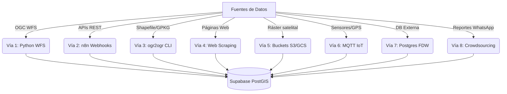

# 🚀 Plan de Ingesta y Recolección de Datos de GEO Perú
### *GeoTERRA: Arquitectura Completa de 8 Vías de Ingesta para la IDEP*

Este documento detalla la estrategia completa de ingeniería de datos para recolectar, procesar y sincronizar todos los conjuntos de datos oficiales y de telemetría de **GEO Perú** y del entorno ciberfísico en la base de datos **Supabase PostGIS** de GeoTERRA.

---

## 🛠️ Arquitectura General de Ingesta (8 Vías)

Para que el ecosistema GeoTERRA opere de forma robusta, autónoma y costo-eficiente, la recolección de información se divide en **8 canales de integración diferenciados** según la frecuencia, el peso y la naturaleza del dato:



---

## 📥 Especificación Detallada de las Vías de Ingesta

### 📡 Vía 1: Conexión Autónoma Vectorial (Python + OGC WFS)
*   **¿Qué es?** Extracción automática de geometrías vectoriales (Puntos, Líneas, Polígonos). El backend en Python realiza consultas HTTP a las URLs WFS del Estado y descarga coordenadas y atributos directamente a PostGIS.
*   **Frecuencia:** Programado con un *Cronjob* (semanal o mensual).
*   **Entidades:**
    *   **MIDAGRI:** Catastro de parcelas agrarias y Capacidad de Uso Mayor.
    *   **MTC:** Red Vial Nacional, Departamental y Vecinal.
    *   **CENEPRED:** Polígonos de susceptibilidad a huaicos y desbordes.
    *   **INEI / MINSA / MINEDU:** Ubicación de colegios, establecimientos de salud y límites censales.
*   **Implementación:** Uso de `requests` y `psycopg2` para consultar WFS filtrados geográficamente por Bounding Box (`bbox`) e insertar con la función espacial `ST_GeomFromText` en Supabase.

---

### ⚡ Vía 2: Alertas en Tiempo Real (n8n + APIs REST / Webhooks)
*   **¿Qué es?** Conectividad reactiva para datos de alta frecuencia que varían continuamente. Usamos **n8n** como orquestador para consultar APIs públicas del Estado mediante polling periódico o escuchar webhooks sin sobrecargar el servidor científico principal.
*   **Frecuencia:** Tiempo real o consultas periódicas cada 5 a 10 minutos.
*   **Entidades:**
    *   **IGP:** API de últimos sismos (sismos > 5.0 disparan triggers de alertas viales preventivas).
    *   **SENAMHI:** Datos meteorológicos por estación (lluvia, temperatura, viento) para actualizar el modelo físico en caliente.
    *   **INDECI:** Reportes en vivo de emergencias viales y climatológicas (SINPAD).
    *   **MEF:** API de Transparencia Económica (SIAF) para rastrear ejecuciones de presupuesto distrital en prevención de desastres.

---

### 🚜 Vía 3: Ingesta Manual en Lote (Comando `ogr2ogr`)
*   **¿Qué es?** Carga masiva de datos cartográficos base muy pesados (curvas de nivel, litología, etc.) que contienen millones de vértices y **nunca o casi nunca cambian**. Se descargan manualmente los Shapefiles comprimidos una única vez y se inyectan a nivel de consola a Supabase.
*   **Frecuencia:** Setup inicial del sistema o actualizaciones anuales.
*   **Entidades:**
    *   **IGN:** Relieve de curvas de nivel y límites políticos departamentales/provinciales oficiales.
    *   **INGEMMET:** Fallas geológicas activas y litología de la Carta Geológica Nacional.
    *   **SERNANP:** Delimitación de Áreas Naturales Protegidas y reservas ecológicas.
*   **Implementación:** Descarga del archivo `.shp` o `.gpkg` local y subida masiva re-proyectando a EPSG:4326 en consola mediante el comando:
    ```bash
    ogr2ogr -f "PostgreSQL" PG:"host=db.ppcdttdynesnajqtjwfw.supabase.co user=postgres dbname=postgres password=TuContraseña" "capa.shp" -nln tabla_destino -t_srs EPSG:4326 -lco GEOMETRY_NAME=geom -overwrite
    ```

---

### 🕷️ Vía 4: Web Scraping (Python + BeautifulSoup / Playwright)
*   **¿Qué es?** Mecanismo de último recurso. Se implementa para extraer información crítica que el Estado expone en visores web interactivos pero **no publica mediante APIs ni WFS abiertos**.
*   **Frecuencia:** Diaria o semanal.
*   **Entidades:**
    *   **Precios Mayoristas (EMMSA / MIDAGRI):** Raspado del portal diario del Gran Mercado Mayorista para calcular en tiempo real el valor financiero y económico de la carga agrícola transportada por carretera.
    *   **Conflictos Sociales (Defensoría del Pueblo):** Raspado de los reportes mensuales de conflictividad para identificar de manera predictiva zonas con riesgo de bloqueo vial por protestas.

---

### 🛰️ Vía 5: Integración por Data Lakes y Buckets (AWS S3 / GCS)
*   **¿Qué es?** Conexión directa a los repositorios de almacenamiento en la nube donde agencias espaciales vuelcan imágenes crudas satelitales multibanda para el cálculo de índices multiespectrales de teledetección.
*   **Frecuencia:** Diaria o a demanda (según la frecuencia de paso de órbita del satélite).
*   **Entidades:**
    *   **CONIDA:** Imágenes de alta resolución del satélite peruano **PeruSAT-1**.
    *   **Copernicus (ESA):** Imágenes Sentinel-2 (bandas Roja e Infrarroja Cercana para NDVI/NDWI).
    *   **Planet / Landsat.**
*   **Implementación:** Scripts en Python que usan `boto3` para descargar imágenes ráster `.tif`, calculan la matriz ráster del valle agrícola, extraen valores agregados por el polígono catastral de MIDAGRI y los guardan en la tabla `telemetria_iot`, descartando la imagen pesada original para optimizar costos de almacenamiento.

---

### 📡 Vía 6: Flujos de Telemetría Pura (Protocolo MQTT)
*   **¿Qué es?** Conectividad nativa del Internet de las Cosas (IoT) diseñada para recibir millones de pequeños mensajes por segundo de forma segura y liviana, ideal para transmisiones móviles con baja cobertura de señal celular.
*   **Frecuencia:** Tiempo real continuo (milisegundos).
*   **Casos de Uso:**
    *   **Sensores IoT de Campo:** Lecturas continuas bajo tierra de humedad, conductividad y temperatura del Fundo.
    *   **Flota Logística:** Geolocalización GPS en tiempo real de los camiones de carga de alimentos.
*   **Implementación:** Levantamiento de un Broker MQTT (ej. Eclipse Mosquitto) y uso de la librería `paho-mqtt` en Python para escuchar los tópicos de telemetría e inyectar las coordenadas en la base de datos Supabase al instante.

---

### 🔗 Vía 7: Conexión Directa Base a Base (PostgreSQL FDW)
*   **¿Qué es?** Envolturas de Datos Extranjeros (*Foreign Data Wrappers - FDW*). Si existe un convenio de interoperabilidad institucional, permite mapear y consultar de forma síncrona tablas de bases de datos remotas del Estado dentro de nuestro propio motor Supabase.
*   **Frecuencia:** Síncrona en tiempo real (espejo).
*   **Entidades:**
    *   **MIDAGRI (Sistema SICAR):** Acceso directo a predios actualizados al instante.
    *   **MEF (Sistema SIAF):** Para auditoría presupuestaria directa.
*   **Implementación:** Ejecución en Supabase de comandos SQL como `CREATE SERVER` y `CREATE FOREIGN TABLE` utilizando el FDW `postgres_fdw` para realizar `SELECT` directos en tablas remotas de ministerios.

---

### 📱 Vía 8: Inteligencia Geográfica Voluntaria (Crowdsourcing / Bots)
*   **¿Qué es?** Uso de los ciudadanos (transportistas y agricultores) como sensores humanos para reportar y validar bloqueos viales y huaicos antes de que las entidades emiten reportes oficiales.
*   **Frecuencia:** Continua y a demanda.
*   **Casos de Uso:** Reporte directo de transportistas atrapados en carretera confirmando un bloqueo por deslizamiento.
*   **Implementación:** Integración de un chatbot en **n8n** conectado a la **API oficial de WhatsApp Business**. El transportista envía un mensaje tipo *"Carretera bloqueada en Km 380"* y comparte su ubicación GPS. El bot procesa el GeoJSON de la ubicación y lo inyecta temporalmente en la tabla `alertas_desastres`, recalculando el bypass Dijkstra.

---

## 📊 Resumen de Gobernanza de Datos
Este modelo de 8 vías asegura que **GeoTERRA** sea técnica y financieramente viable en producción:

| Tipo de Data | Vía Óptima | Tecnología | Ventaja |
| :--- | :--- | :--- | :--- |
| **Geografía Pesada Estática** | Vía 3 (Manual Lote) | `ogr2ogr` / GDAL | Carga óptima de millones de polígonos sin latencia de red. |
| **Registros Dinámicos Mensuales** | Vía 1 (OGC WFS) | Python `requests` + GIS | Automatización nativa bajo estándares geográficos del Estado. |
| **Alertas Climatológicas y Sismos** | Vía 2 (Webhooks) | n8n / REST API | Reactividad inmediata ante catástrofes. |
| **Imágenes e Índices Satelitales** | Vía 5 (Buckets) | Python Rasterio / `boto3` | Teledetección automatizada sin procesar datos locales. |
| **Camiones y Sensores en Campo** | Vía 6 (MQTT) | Broker MQTT + IoT | Telemetría en tiempo real con mínimo consumo de datos móviles. |
| **Validación Ciudadana** | Vía 8 (Crowdsourcing) | n8n + API de WhatsApp | Alertas tempranas humanas de alta confianza. |
